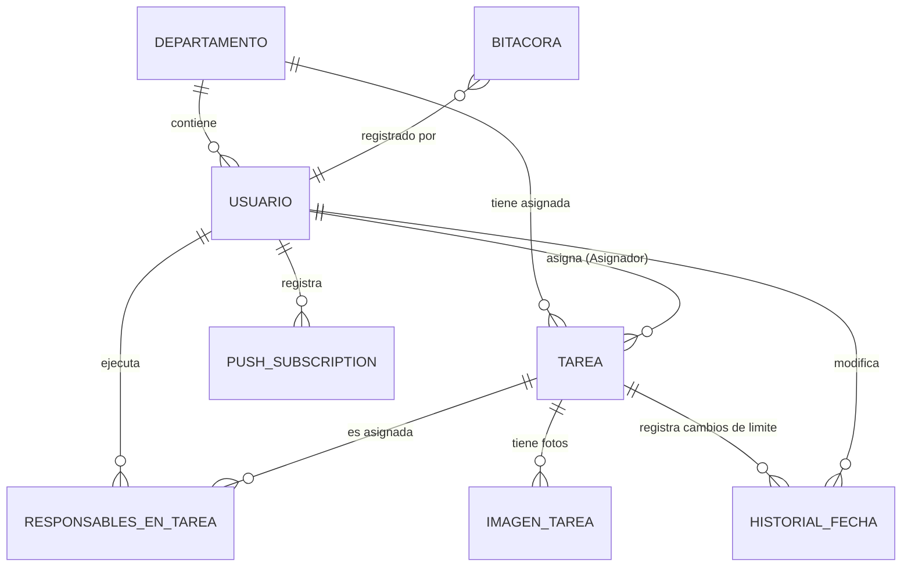
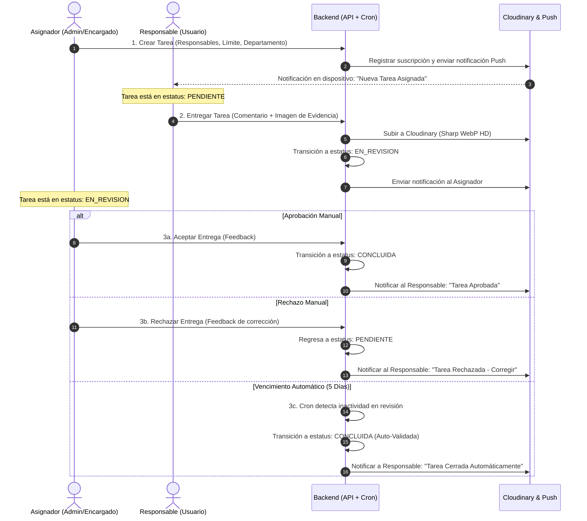

# Documentación del Sistema de Gestión de Tareas de Calidad

Este sistema es una plataforma robusta para la asignación, seguimiento, entrega y revisión de tareas de control de calidad dentro de una organización. El diseño está segmentado en una arquitectura de tres capas: Base de Datos (Relacional mediante Prisma/MySQL), Backend (API REST en Node.js + Express con TypeScript) y Frontend (Single Page Application en React con TypeScript + Vite).

---

## 1. Arquitectura de Base de Datos (`schema.prisma`)

La persistencia de datos está implementada sobre **MySQL** utilizando **Prisma ORM**. El diseño de la base de datos está normalizado y cuenta con índices estratégicos para optimizar el rendimiento del panel de métricas y consultas frecuentes.

### Enums
*   `Estatus`: Define el estado del ciclo de vida de una tarea: `PENDIENTE`, `EN_REVISION`, `CONCLUIDA`, `CANCELADA`.
*   `Urgencia`: Prioridad de la tarea: `BAJA`, `MEDIA`, `ALTA`.
*   `Rol`: Roles de autorización del sistema: `SUPER_ADMIN` (control total multidepartamento), `ADMIN` (gestión del departamento propio), `ENCARGADO` (colaborador con permisos de asignación limitados), `USUARIO` (responsable ejecutor), `INVITADO` (solo lectura).
*   `Tipo`: Clasificación de departamentos: `ADMINISTRATIVO`, `OPERATIVO`.
*   `EstatusUsuario`: Estatus de login del personal: `ACTIVO`, `INACTIVO` (permite soft-deletes).

### Modelos y Tablas


1.  **`Departamento`**: Almacena el nombre e identificación del departamento y su clasificación (`Tipo`).
2.  **`Usuario`**: Perfil de cada colaborador del sistema, enlazado a un departamento. Tiene índices en `departamentoId` y `estatus` para acelerar el inicio de sesión y filtrados.
3.  **`Tarea`**: Entidad central que define el trabajo a realizar. Contiene fechas clave (límite, registro, conclusión, entrega, revisión), campos para auto-validación y llaves foráneas a departamento y asignador.
    *   *Índices de Rendimiento*: Indexación por `departamentoId`, `asignadorId`, `estatus`, `fechaLimite`, `fechaRegistro` y `urgencia`.
4.  **`ResponsablesEnTarea`**: Tabla pivote muchos-a-muchos entre `Usuario` y `Tarea`. Tiene un índice compuesto en `[usuarioId, tareaId]` y uno dedicado a `usuarioId` para optimizar la vista de "Mis Tareas".
5.  **`ImagenTarea`**: Historial de fotos asociadas a una tarea (descripciones visuales iniciales).
6.  **`HistorialFecha`**: Registro histórico de cambios en la fecha límite de una tarea, capturando la fecha anterior, nueva fecha, motivo y el usuario que efectuó el cambio.
7.  **`PushSubscription`**: Datos de subscripción de navegadores/dispositivos para notificaciones web-push asociadas a cada usuario.
8.  **`Bitacora`**: Auditoría general del sistema (logs persistidos) con estructura JSON para detalles adicionales.

---

## 2. Backend (`backend/src`)

El backend está desarrollado sobre Node.js y Express en formato ESM (ES Modules).

```
backend/src/
├── config/             # Configuraciones globales y de entorno
├── middleware/         # Validadores, autenticadores y formateadores de petición
├── modules/            # Módulos del dominio de negocio (Controladores y Rutas)
├── services/           # Lógica en segundo plano (cron, logs persistentes)
├── utils/              # Funciones auxiliares y de integración externa
└── server.ts           # Inicialización de la aplicación
```

### Configuración (`backend/src/config`)
*   **`envs.ts`**: Carga y valida las variables de entorno utilizando `zod`. Si falta una variable crítica en el `.env` (como credenciales de Cloudinary, firma de JWT o claves VAPID), el servidor detiene su proceso inmediatamente para evitar comportamientos erráticos.
*   **`db.ts`**: Instancia global del cliente de Prisma (`PrismaClient`).
*   **`cors.ts`**: Configuración dinámica de seguridad CORS. Permite peticiones de dominios autorizados y redes locales de desarrollo.
*   **`businessRules.ts`**: Centralización de lógica del negocio. Define, por ejemplo, qué departamentos tienen jerarquía libre (como `"Pieles"`), permitiendo flujos de asignación bidireccional entre puestos.

### Middlewares (`backend/src/middleware`)
*   **`verifyToken.ts`**: Autentica peticiones mediante tokens JWT inyectados en la cabecera `Authorization`. Realiza una validación reactiva en base de datos para confirmar que el usuario que porta el token sigue `ACTIVO`. Adicionalmente implementa la autorización basada en roles (`Rol`).
*   **`errorHandler.ts`**: Intercepta excepciones no controladas. Traduce códigos de error nativos de base de datos (Prisma) o esquemas de validación (Zod) a respuestas legibles para el cliente.
*   **`requestLogger.ts`**: Middleware de bitácora en consola. Interpreta las llamadas de API traduciéndolas a acciones legibles humanas (ej. `"🚀 Entregando Tarea #12"`) y calcula los milisegundos de respuesta.
*   **`upload.ts`**: Configura `multer` para procesar archivos de imagen entrantes almacenándolos en la memoria RAM de manera temporal antes de ser optimizados.

### Módulos (`backend/src/modules`)
El backend organiza sus endpoints por módulos funcionales. Cada módulo expone sus rutas en un archivo `*.routes.ts` y delega la ejecución a controladores especializados:

1.  **Auth**: Inicio de sesión (`/login`), verificación de token (`/verify`) y salida (`/logout`).
2.  **Departamentos**: CRUD e inicialización de departamentos. Solo administradores y súper administradores pueden crear o alterar su estructura.
3.  **Logs**: Endpoint para extraer el historial de la bitácora del sistema (Acceso exclusivo a `SUPER_ADMIN`).
4.  **Usuarios**: Administración del personal de la empresa. Soporta creación, edición, desactivación (soft-delete cambiando el estatus a `INACTIVO`) y suscripción a notificaciones push.
5.  **Tareas**: Flujo de trabajo central del sistema.
    *   `GET /`: Ruta unificada que recibe queries (`?viewType=MIS_TAREAS|ASIGNADAS|TODAS`) para devolver tareas en base al rol de forma optimizada y filtrada.
    *   `GET /kpis`: Endpoint dedicado para extraer contadores de eficiencia por departamento o por usuarios (`obtenerKPIs.controller.ts`), aplicando el rango de fecha límite seleccionado.
    *   `POST /:id/entregar`: Permite al usuario subir evidencias a una tarea y cambiar su estatus a `EN_REVISION`.
    *   `POST /:id/revision`: Flujo de aprobación o rechazo por parte del asignador.

### Servicios (`backend/src/services`)
*   **`logger.service.ts`**: Modela e inserta registros en la tabla `Bitacora`.
*   **`cron.service.ts`**: Ejecuta tareas automáticas recurrentes mediante `node-cron`:
    1.  *Auto-Validación*: Cada hora, el sistema busca tareas en estatus `EN_REVISION` que lleven más de 5 días naturales sin cambios. El sistema las concluye automáticamente mediante una transacción atómica y notifica a los responsables.
    2.  *Recordatorios Matutinos (9:00 AM)*: Avisa a asignadores sobre aprobaciones pendientes y a encargados sobre vencimientos en el día o tareas retrasadas.
    3.  *Alertas Vespertinas (4:30 PM)*: Recordatorios rápidos para tareas críticas antes de finalizar la jornada laboral.

### Utilidades (`backend/src/utils`)
*   **`safeAsync.ts`**: Función de orden superior que envuelve controladores asíncronos para capturar promesas rechazadas y canalizarlas al manejador de errores global sin saturar el código de bloques `try-catch`.
*   **`cloudinaryUtils.ts`**: Administra la integración con Cloudinary. Procesa las imágenes subidas por el usuario optimizándolas al vuelo (compresión WebP con Sharp a calidad 80% y redimensión a un ancho máximo de 1280px) para mitigar el consumo de red y almacenamiento en la nube.
*   **`holidayUtils.ts`**: Determina si un día dado es inhábil en México (días festivos fijos y periodos dinámicos como Semana Santa o periodos vacacionales de fin de año). Evita el envío invasivo de notificaciones push en días no laborables.

---

## 3. Frontend (`frontend/src`)

El frontend está construido con React 18, TypeScript, TailwindCSS y Vite.

### Consumo de API (`frontend/src/api`)
El consumo del backend se centraliza a través de un cliente HTTP estructurado:
*   **`01_axiosInstance.ts`**: Instancia de Axios con interceptores. Inyecta automáticamente el token JWT desde el `localStorage` en cada petición y ajusta el puerto dinámicamente si detecta que la aplicación corre desde un emulador de Android (`10.0.2.2`).
*   **Services**: Abstracciones de llamadas al backend estructuradas por dominio: `auth.service.ts`, `departamentos.service.ts`, `logs.service.ts`, `tareas.service.ts` y `usuarios.service.ts`.

### Páginas Principales (`frontend/src/pages`)
1.  **`LoginPage.tsx`**: Pantalla de acceso. Gestiona el almacenamiento del token y redirige a los usuarios según su rol.
2.  **`Pendientes.tsx`**: Panel principal para el personal operativo. Muestra tareas personales pendientes del día, tareas en curso y un resumen de las concluidas.
3.  **`Admin.tsx`**: Tablero de gestión de tareas del departamento. Permite crear, modificar, reasignar fechas límite y auditar evidencias enviadas por los trabajadores.
4.  **`Super_Admin.tsx`**: Panel global de visualización del estado de la empresa. Contiene métricas generales y acceso a la bitácora del sistema.
5.  **`Usuarios.tsx`**: Consola de administración de personal del departamento (creación, edición y suspensión de usuarios).

### Componentes Clave (`frontend/src/components`)
*   **`PrivateRoute.tsx` / `PublicRoute.tsx`**: Guardias de navegación que aseguran que rutas sensibles requieran sesión iniciada y que usuarios logueados no regresen a la pantalla de login.
*   **`layout/Layout.tsx`**: Estructura visual de la aplicación con barra de navegación adaptativa (móvil/escritorio) y perfiles del usuario actual.
*   **`Pendientes/`**: Carpeta que contiene la tabla de visualización (incluyendo una vista compacta para móviles en `TablaPendientesMobile.tsx`), filtros temporales, y el `ModalEntrega.tsx` para subir evidencias de cumplimiento de tareas.
*   **`Principal/`**: Componentes reutilizables para el desglose del Dashboard (gráficas de cumplimiento, resúmenes analíticos y visor de imágenes de evidencia).

---

## 4. Flujo del Sistema Paso a Paso

El flujo de trabajo operativo de las tareas se rige bajo la siguiente secuencia de estados y validaciones:



1.  **Asignación de Tarea**: Un usuario con rol `ADMIN`, `SUPER_ADMIN` o `ENCARGADO` genera una nueva tarea asignando responsables, departamento y fecha límite. El backend valida el flujo jerárquico y notifica mediante notificaciones Web Push.
2.  **Ejecución y Entrega**: El responsable (operativo) visualiza la tarea en su panel. Al completarla, abre el `ModalEntrega`, redacta un comentario y adjunta fotos de evidencia. Las fotos se optimizan y comprimen en el servidor antes de subirse a Cloudinary. El estado de la tarea pasa a `EN_REVISION`.
3.  **Proceso de Revisión**: El creador de la tarea revisa el entregable:
    *   Si aprueba, la tarea finaliza y pasa a `CONCLUIDA`.
    *   Si rechaza, ingresa observaciones detalladas y la tarea retorna a `PENDIENTE` para que los responsables hagan los problemas correspondientes.
    *   Si el asignador no emite un veredicto tras 5 días, el cronjob de **Auto-Validación** interviene liberando administrativamente la tarea con el estatus `CONCLUIDA` y la bandera `fueAutoValidada` en `true`.
